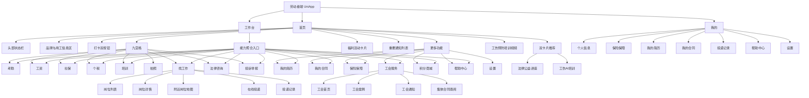

# 劳动者端 UniApp 功能清单 + 页面结构图 + 接口清单

## 1. 文档依据与口径

本版只以以下两份文档作为设计依据：

- `D:/work/yuegongbao/APP分析说明书.docx`
- `D:/work/yuegongbao/（好）一二三级功能模块（后台、小程序、APP、官网））530.docx`

口径固定如下：

- 《APP分析说明书》是劳动者端 `UniApp` 的主口径，决定产品定位、首页结构、九宫格主链、培训联动规则、活动区、通知区、推荐区、设置项。
- `530` 只补充劳动者端扩展功能，不反向改写《APP分析说明书》已经定下的首页主结构。
- 本文只覆盖劳动者本人使用的 `UniApp`，不混入企业端小程序、PC 后台、监管端 APP、劳务屏专用 APP。
- 本文的接口清单优先对齐当前仓库 `yuegongbao-worker-uniapp/src/api/worker.js` 已存在接口；文档要求但仓库暂未统一沉淀的能力，以“应补接口”标注。

## 2. 产品定位与边界

### 2.1 产品定位

劳动者端 `UniApp` 固定定位为：

- 面向劳动者的一站式用工保障助手
- 连接监管数据与个人服务的移动入口
- 聚焦 `考勤 / 工资 / 社保 / 个税 / 培训 / 求职 / 维权 / 活动`

### 2.2 目标用户

- 劳务派遣员工
- 灵活就业人员
- 新业态从业人员
- 用工单位基层员工

### 2.3 权限边界

- 仅劳动者本人登录使用
- 仅查看本人档案、本人考勤、本人工资、本人社保、本人个税、本人培训、本人投诉、本人求职记录
- 企业管理、监管驾驶舱、预警处置、设备运维、外出作业审批等能力不进入本端

### 2.4 导航结构

底部 `Tab` 固定为：

- 首页
- 工作台
- 我的

## 3. 设计总原则

### 3.1 首页顺序必须服从《APP分析说明书》

首页自上而下固定为：

1. 头部状态栏
2. 品牌与用工信息区
3. 打卡双按钮
4. 九宫格功能入口
5. 更多功能
6. 福利活动卡片
7. 重要通知列表
8. 双卡片推荐
9. 工伤预防知识培训视频

### 3.2 培训联动是主业务规则

每月必须完成 `10` 道安全培训题后，才允许：

- 上班打卡
- 下班打卡
- 工资查询

前端要做按钮级拦截，后端也必须做强校验。未完成培训时，统一提示“请先完成本月安全培训”并引导进入培训模块。

### 3.3 `530` 扩展项只进入扩展能力池

来自 `530`、且属于劳动者端的扩展能力包括：

- 工会服务
- 集体合同查阅
- 保险保障
- 我的简历
- 投递记录
- 附近岗位地图
- 个人劳动合同电子版查看
- 积分商城
- 上传归档记录

这些能力可以进入“更多功能 / 工作台 / 我的”，但不改写首页主链结构。

### 3.4 不纳入本文主清单的能力

以下内容不属于劳动者端 `UniApp` 主范围：

- 企业端移动办公
- 监管端驾驶舱与预警中心
- 高危扫码开机
- 外出作业申请与审批
- 设备锁机、解锁、围栏、芯片库存
- 企业工资确认、企业招聘后台

## 4. 功能清单

## 4.1 首页主链功能

### 4.1.1 头部状态栏

功能要求：

- 展示平台版本标识
- 提供通知入口
- 提供设置入口

页面承接：

- `pages/home/index`
- `pages/notice/list`
- `pages/profile/settings`

接口承接：

- `GET /app/worker/home`
- `GET /app/worker/settings/detail`

### 4.1.2 品牌与用工信息区

功能要求：

- 展示“阳光劳务”品牌标题
- 展示当前劳动者所属用工单位
- 展示当前日期与星期
- 展示劳动者本人卡片摘要
- 展示脱敏姓名、工种、身份标签、电子工牌码

页面承接：

- `pages/home/index`

接口承接：

- `GET /app/worker/home`
- `GET /app/worker/profile`

### 4.1.3 打卡双按钮

功能要求：

- 上班打卡
- 下班打卡
- 获取定位
- 支持离线缓存与网络恢复后补传
- 下班打卡前必须校验已有上班记录
- 打卡前必须校验本月培训完成度

业务规则：

- 本月未完成 `10` 题培训时，不允许打卡
- 点击后提示“请先完成本月安全培训”
- 自动引导进入培训页面

页面承接：

- `pages/home/index`
- `pages/attendance/checkin`
- `pages/attendance/detail`
- `pages/training/index`

接口承接：

- `GET /app/worker/training/progress`
- `POST /app/worker/attendance/check-in`
- `POST /app/worker/attendance/check-out`
- `GET /app/worker/attendance/monthly`
- `GET /app/worker/attendance/day`

### 4.1.4 九宫格功能入口

九宫格固定为以下九项：

1. 考勤
2. 工资
3. 社保
4. 个税
5. 培训
6. 拍照
7. 找工作
8. 法律咨询
9. 投诉举报

页面承接：

- `pages/attendance/checkin`
- `pages/salary/list`
- `pages/social/list`
- `pages/tax/list`
- `pages/training/index`
- `pages/camera/index`
- `pages/job/list`
- `pages/legal/index`
- `pages/complaint/index`

### 4.1.5 更多功能

“更多功能”是《APP分析说明书》给扩展服务预留的聚合入口。按两份文档综合后，应承接：

- 我的简历
- 我的合同
- 保险保障
- 工会服务
- 积分商城
- 帮助中心
- 设置

页面承接：

- `pages/profile/resume`
- `pages/profile/labor-contracts`
- `pages/profile/security`
- `pages/union/index`
- `pages/profile/points`
- `pages/profile/help`
- `pages/profile/settings`

接口承接：

- `GET /app/worker/home`

### 4.1.6 福利活动卡片

功能要求：

- 首页展示福利活动主卡
- 支持进入活动详情
- 支持跳转外部活动 H5
- 支持记录参与结果

页面承接：

- `pages/home/index`
- `pages/activity/detail`
- `pages/activity/webview`
- `pages/activity/join-list`

接口承接：

- `GET /app/worker/activity/detail`
- `POST /app/worker/activity/join`
- `GET /app/worker/activity/join-list`

### 4.1.7 重要通知列表

功能要求：

- 首页展示最新通知
- 支持“更多播报”
- 支持进入通知列表
- 支持进入通知详情
- 支持已读标记

页面承接：

- `pages/home/index`
- `pages/notice/list`
- `pages/notice/detail`

接口承接：

- `GET /app/worker/notice/list`
- `GET /app/worker/notice/detail`
- `POST /app/worker/notice/read`

### 4.1.8 双卡片推荐

双卡片固定为：

- 法律公益讲座
- 工伤 AI 培训

页面承接：

- `pages/legal/article-list`
- `pages/legal/article-detail`
- `pages/ai-training/detail`

接口承接：

- `GET /app/worker/legal-article/list`
- `GET /app/worker/legal-article/detail`
- `GET /app/worker/ai-training/detail`

### 4.1.9 工伤预防知识培训视频

功能要求：

- 首页展示工伤预防视频推荐
- 支持进入视频列表
- 支持进入视频详情
- 支持真实播放与进度回写

页面承接：

- `pages/home/index`
- `pages/video/list`
- `pages/video/detail`

接口承接：

- `GET /app/worker/video/list`
- `GET /app/worker/video/detail`
- `POST /app/worker/video/progress`

## 4.2 核心业务模块

### 4.2.1 登录与身份装载

功能要求：

- 账号密码登录
- 登录后装载劳动者身份
- 装载本人档案与本人用工关系
- 装载首页所需摘要数据

页面承接：

- `pages/login/index`

接口承接：

- 应复用现有认证接口
- `GET /app/worker/profile`
- `GET /app/worker/home`

说明：

- 当前 `worker.js` 未定义独立 `login` 方法，说明认证很可能由统一鉴权模块承接；本文不强行重命名现有登录方案。

### 4.2.2 考勤

功能要求：

- 月历视图展示打卡状态
- 查看某日上下班记录
- 展示正常、迟到、早退、缺卡等状态
- 支持当日打卡
- 支持离线打卡补传

页面承接：

- `pages/attendance/checkin`
- `pages/attendance/detail`

接口承接：

- `GET /app/worker/attendance/monthly`
- `GET /app/worker/attendance/day`
- `POST /app/worker/attendance/check-in`
- `POST /app/worker/attendance/check-out`

### 4.2.3 工资

功能要求：

- 展示最近工资列表
- 支持工资详情
- 展示应发、实发、扣款、银行流水、失败原因、备注
- 与培训完成度联动

页面承接：

- `pages/salary/list`
- `pages/salary/detail`

接口承接：

- `GET /app/worker/salary/list`
- `GET /app/worker/salary/detail`
- `GET /app/worker/training/progress`

### 4.2.4 社保

功能要求：

- 展示参保状态
- 展示年度汇总
- 展示月度缴费记录
- 展示单位缴费、个人缴费、缴费基数、来源信息

页面承接：

- `pages/social/list`
- `pages/social/detail`

接口承接：

- `GET /app/worker/social-security/list`
- `GET /app/worker/social-security/detail`

说明：

- 当前仓库已补年度汇总和来源信息；若个人缴费金额底层未稳定拆分，可明确展示“待回写”，不能伪造。

### 4.2.5 个税

功能要求：

- 展示年度累计个税汇总
- 展示月度明细
- 展示应税收入、应纳税额、实缴税额、差异状态、来源信息

页面承接：

- `pages/tax/list`
- `pages/tax/detail`

接口承接：

- `GET /app/worker/tax/list`
- `GET /app/worker/tax/detail`

### 4.2.6 培训

功能要求：

- 展示本月培训进度
- 展示待答题列表
- 支持逐题答题
- 支持课程学习
- 支持历史记录查询
- 支持学习进度回写

页面承接：

- `pages/training/index`
- `pages/training/questions`
- `pages/training/course-detail`
- `pages/training/history`

接口承接：

- `GET /app/worker/training/progress`
- `GET /app/worker/training/questions`
- `POST /app/worker/training/answer`
- `GET /app/worker/training/history`
- `GET /app/worker/training/courses`
- `GET /app/worker/training/course-detail`
- `POST /app/worker/training/study-progress`

### 4.2.7 拍照与上传归档

功能要求：

- 调用相机或相册
- 图片压缩上传
- 可作为投诉证据
- 可作为现场留痕
- 形成上传归档记录

页面承接：

- `pages/camera/index`

接口承接：

- `POST /common/upload`
- `POST /app/worker/upload-record/create`
- `GET /app/worker/upload-record/list`

### 4.2.8 找工作

功能要求：

- 岗位列表
- 支持按关键词、工种、薪资区间筛选
- 支持距离筛选
- 支持岗位详情
- 支持附近岗位地图
- 支持在线投递
- 投递前必须已完善简历
- 支持投递记录查看

页面承接：

- `pages/job/list`
- `pages/job/detail`
- `pages/job/map`
- `pages/job/apply-list`
- `pages/profile/resume`

接口承接：

- `GET /app/worker/job/list`
- `GET /app/worker/job/detail`
- `GET /app/worker/job/map-config`
- `GET /app/worker/job/nearby`
- `POST /app/worker/job/apply`
- `GET /app/worker/job/apply/list`
- `GET /app/worker/resume/detail`
- `POST /app/worker/resume/save`

业务规则：

- 岗位投递必须以后端简历完整性校验为准，前端只做引导，不替代后端判断。

### 4.2.9 法律咨询

功能要求：

- 常见法律问题库
- 支持关键词检索
- 支持 FAQ 详情
- 支持在线咨询表单
- 支持咨询记录与详情
- 支持上传咨询附件
- 支持一键拨打 `12351`

页面承接：

- `pages/legal/index`
- `pages/legal/detail`
- `pages/legal/faq-detail`

接口承接：

- `GET /app/worker/legal-faq/list`
- `GET /app/worker/legal-faq/detail`
- `POST /app/worker/legal-consult/create`
- `GET /app/worker/legal-consult/list`
- `GET /app/worker/legal-consult/detail`
- `GET /app/worker/legal-consult/hotline`
- `POST /common/upload`
- `POST /app/worker/upload-record/create`

### 4.2.10 投诉举报

功能要求：

- 选择投诉类型
- 填写投诉内容
- 上传证据附件
- 生成投诉工单
- 跟踪处理状态
- 可选择同步工会

页面承接：

- `pages/complaint/index`
- `pages/complaint/detail`

接口承接：

- `POST /app/worker/complaint/create`
- `GET /app/worker/complaint/list`
- `GET /app/worker/complaint/detail`
- `POST /common/upload`

## 4.3 内容、活动与推荐服务

### 4.3.1 法律公益讲座

功能要求：

- 展示讲座列表
- 支持图文或视频详情
- 支持从首页双卡片进入

页面承接：

- `pages/legal/article-list`
- `pages/legal/article-detail`

接口承接：

- `GET /app/worker/legal-article/list`
- `GET /app/worker/legal-article/detail`

### 4.3.2 工伤 AI 培训

功能要求：

- 首页推荐卡进入
- 展示 AI 培训说明、课程或服务入口
- 作为工伤预防扩展服务承接

页面承接：

- `pages/ai-training/detail`

接口承接：

- `GET /app/worker/ai-training/detail`

### 4.3.3 福利活动与参与记录

功能要求：

- 活动卡承接运营活动
- 支持活动详情、外部 H5、参与记录
- 保持首页与活动页文案一致

页面承接：

- `pages/activity/detail`
- `pages/activity/webview`
- `pages/activity/join-list`

接口承接：

- `GET /app/worker/activity/detail`
- `POST /app/worker/activity/join`
- `GET /app/worker/activity/join-list`

### 4.3.4 重要通知

功能要求：

- 首页展示最近通知
- 列表查看全部通知
- 详情查看正文
- 已读回写

页面承接：

- `pages/home/index`
- `pages/notice/list`
- `pages/notice/detail`

接口承接：

- `GET /app/worker/notice/list`
- `GET /app/worker/notice/detail`
- `POST /app/worker/notice/read`

### 4.3.5 工伤预防视频

功能要求：

- 视频列表
- 视频详情
- 真实播放
- 自动保存观看进度
- 播放完成自动学完

页面承接：

- `pages/video/list`
- `pages/video/detail`

接口承接：

- `GET /app/worker/video/list`
- `GET /app/worker/video/detail`
- `POST /app/worker/video/progress`

## 4.4 工作台与我的

### 4.4.1 工作台

工作台不是第二套业务口径，而是劳动者端能力聚合页。应集中承接：

- 考勤
- 工资
- 社保
- 个税
- 培训
- 找工作
- 投诉举报
- 法律咨询
- 工会服务
- 保险保障
- 我的简历
- 我的合同
- 投递记录
- 积分商城
- 帮助中心

页面承接：

- `pages/workbench/index`

接口承接：

- `GET /app/worker/home`
- 其余模块继续复用各自接口

### 4.4.2 我的

“我的”只承接个人资料和个人扩展服务，不再新增独立业务口径：

- 个人信息
- 保险保障
- 我的简历
- 我的合同
- 投递记录
- 帮助中心
- 设置

页面承接：

- `pages/profile/index`
- `pages/profile/security`
- `pages/profile/resume`
- `pages/profile/labor-contracts`
- `pages/job/apply-list`
- `pages/profile/help`
- `pages/profile/settings`

### 4.4.3 我的简历

功能要求：

- 简历详情查看
- 简历编辑保存
- 作为岗位投递前置条件

页面承接：

- `pages/profile/resume`

接口承接：

- `GET /app/worker/resume/detail`
- `POST /app/worker/resume/save`

### 4.4.4 个人劳动合同电子版查看

该项来自 `530`，必须与“集体合同查阅”区分：

- 个人劳动合同列表
- 个人劳动合同详情
- 电子版预览或打开文档

页面承接：

- `pages/profile/labor-contracts`
- `pages/profile/labor-contract-detail`

接口承接：

- `GET /app/worker/labor-contract/list`
- `GET /app/worker/labor-contract/detail`

### 4.4.5 保险保障

功能要求：

- 展示工伤保险状态
- 展示安责险或相关保障摘要
- 展示保障额度、有效期、状态说明

页面承接：

- `pages/profile/security`

接口承接：

- `GET /app/worker/insurance/security`

### 4.4.6 帮助中心

功能要求：

- 常见问题列表
- 帮助详情
- 意见反馈
- 在线客服入口说明

页面承接：

- `pages/profile/help`
- `pages/profile/help-detail`

接口承接：

- `GET /app/worker/help/list`
- `GET /app/worker/help/detail`
- `POST /app/worker/feedback/create`

说明：

- 当前仓库已实现“帮助列表 + 详情 + 意见反馈提交”。
- “在线客服”在说明书里属于能力要求，若后续需要真实客服会话，应补独立客服入口或 H5 承接页；当前可先作为帮助中心说明项。

### 4.4.7 设置

功能要求：

- 账号安全
- 消息通知开关
- 清理缓存
- 退出登录
- 隐私协议展示

页面承接：

- `pages/profile/settings`
- `pages/profile/account-security`

接口承接：

- `GET /app/worker/settings/detail`
- `POST /app/worker/settings/save`

### 4.4.8 积分商城

功能要求：

- 积分账户查看
- 商品兑换

页面承接：

- `pages/profile/points`

接口承接：

- `GET /app/worker/points/account`
- `POST /app/worker/points/exchange`

## 4.5 工会服务扩展模块

### 4.5.1 工会服务首页

功能要求：

- 工会服务聚合页
- 法律援助入口
- 工会通知入口
- 典型案例入口
- 集体合同查阅入口
- 工会热线直拨

页面承接：

- `pages/union/index`

接口承接：

- `GET /app/worker/union-service/home`

### 4.5.2 工会案例与通知

功能要求：

- 工会典型案例查看
- 工会通知查看

页面承接：

- `pages/union/case-detail`
- `pages/union/notice-detail`

接口承接：

- `GET /app/worker/union-service/cases`
- `GET /app/worker/union-service/case-detail`
- `GET /app/worker/union-service/notices`
- `GET /app/worker/union-service/notice-detail`

### 4.5.3 集体合同查阅

功能要求：

- 集体合同列表
- 集体合同详情

页面承接：

- `pages/union/contracts`
- `pages/union/contract-detail`

接口承接：

- `GET /app/worker/union-service/contracts`
- `GET /app/worker/union-service/contract-detail`

## 5. 页面结构图

## 6. 接口清单

## 6.1 首页与身份

| 方法 | 路径 | 用途 |
| --- | --- | --- |
| `GET` | `/app/worker/home` | 首页聚合数据 |
| `GET` | `/app/worker/profile` | 劳动者本人信息 |
| `POST` | 现有统一认证接口 | 登录认证，当前未在 `worker.js` 独立定义 |

## 6.2 培训与打卡

| 方法 | 路径 | 用途 |
| --- | --- | --- |
| `GET` | `/app/worker/training/progress` | 本月培训进度 |
| `GET` | `/app/worker/training/questions` | 培训题目列表 |
| `POST` | `/app/worker/training/answer` | 提交答题 |
| `GET` | `/app/worker/training/history` | 培训历史 |
| `GET` | `/app/worker/training/courses` | 培训课程列表 |
| `GET` | `/app/worker/training/course-detail` | 培训课程详情 |
| `POST` | `/app/worker/training/study-progress` | 保存学习进度 |
| `POST` | `/app/worker/attendance/check-in` | 上班打卡 |
| `POST` | `/app/worker/attendance/check-out` | 下班打卡 |
| `GET` | `/app/worker/attendance/monthly` | 月度考勤日历 |
| `GET` | `/app/worker/attendance/day` | 单日考勤详情 |

## 6.3 工资、社保、个税

| 方法 | 路径 | 用途 |
| --- | --- | --- |
| `GET` | `/app/worker/salary/list` | 工资列表 |
| `GET` | `/app/worker/salary/detail` | 工资详情 |
| `GET` | `/app/worker/social-security/list` | 社保列表 |
| `GET` | `/app/worker/social-security/detail` | 社保详情 |
| `GET` | `/app/worker/tax/list` | 个税列表 |
| `GET` | `/app/worker/tax/detail` | 个税详情 |

## 6.4 法律咨询与投诉举报

| 方法 | 路径 | 用途 |
| --- | --- | --- |
| `GET` | `/app/worker/legal-faq/list` | 法律 FAQ 列表与关键词检索 |
| `GET` | `/app/worker/legal-faq/detail` | FAQ 详情 |
| `POST` | `/app/worker/legal-consult/create` | 提交法律咨询 |
| `GET` | `/app/worker/legal-consult/list` | 法律咨询记录 |
| `GET` | `/app/worker/legal-consult/detail` | 法律咨询详情 |
| `GET` | `/app/worker/legal-consult/hotline` | 工会热线 |
| `POST` | `/app/worker/complaint/create` | 提交投诉举报 |
| `GET` | `/app/worker/complaint/list` | 投诉列表 |
| `GET` | `/app/worker/complaint/detail` | 投诉详情 |
| `POST` | `/common/upload` | 上传咨询/投诉证据图片 |

## 6.5 通知、活动、视频、推荐内容

| 方法 | 路径 | 用途 |
| --- | --- | --- |
| `GET` | `/app/worker/notice/list` | 通知列表 |
| `GET` | `/app/worker/notice/detail` | 通知详情 |
| `POST` | `/app/worker/notice/read` | 标记通知已读 |
| `GET` | `/app/worker/activity/detail` | 福利活动详情 |
| `POST` | `/app/worker/activity/join` | 参与活动 |
| `GET` | `/app/worker/activity/join-list` | 活动参与记录 |
| `GET` | `/app/worker/video/list` | 工伤预防视频列表 |
| `GET` | `/app/worker/video/detail` | 视频详情 |
| `POST` | `/app/worker/video/progress` | 保存视频进度 |
| `GET` | `/app/worker/legal-article/list` | 法律公益讲座列表 |
| `GET` | `/app/worker/legal-article/detail` | 法律公益讲座详情 |
| `GET` | `/app/worker/ai-training/detail` | 工伤 AI 培训详情 |

## 6.6 找工作、简历、合同

| 方法 | 路径 | 用途 |
| --- | --- | --- |
| `GET` | `/app/worker/job/list` | 岗位列表 |
| `GET` | `/app/worker/job/detail` | 岗位详情 |
| `GET` | `/app/worker/job/map-config` | 附近岗位地图配置 |
| `GET` | `/app/worker/job/nearby` | 附近岗位列表 |
| `POST` | `/app/worker/job/apply` | 投递岗位，后端必须校验简历已完善 |
| `GET` | `/app/worker/job/apply/list` | 投递记录 |
| `GET` | `/app/worker/resume/detail` | 简历详情 |
| `POST` | `/app/worker/resume/save` | 保存简历 |
| `GET` | `/app/worker/labor-contract/list` | 个人劳动合同列表 |
| `GET` | `/app/worker/labor-contract/detail` | 个人劳动合同详情 |

## 6.7 帮助、设置、保险、积分、上传归档

| 方法 | 路径 | 用途 |
| --- | --- | --- |
| `GET` | `/app/worker/help/list` | 帮助列表 |
| `GET` | `/app/worker/help/detail` | 帮助详情 |
| `POST` | `/app/worker/feedback/create` | 意见反馈 |
| `GET` | `/app/worker/settings/detail` | 设置详情 |
| `POST` | `/app/worker/settings/save` | 保存设置 |
| `GET` | `/app/worker/insurance/security` | 保险保障信息 |
| `GET` | `/app/worker/points/account` | 积分账户 |
| `POST` | `/app/worker/points/exchange` | 积分兑换 |
| `POST` | `/app/worker/upload-record/create` | 创建上传归档记录 |
| `GET` | `/app/worker/upload-record/list` | 上传归档列表 |

## 6.8 工会服务

| 方法 | 路径 | 用途 |
| --- | --- | --- |
| `GET` | `/app/worker/union-service/home` | 工会服务首页 |
| `GET` | `/app/worker/union-service/cases` | 工会案例列表 |
| `GET` | `/app/worker/union-service/case-detail` | 工会案例详情 |
| `GET` | `/app/worker/union-service/notices` | 工会通知列表 |
| `GET` | `/app/worker/union-service/notice-detail` | 工会通知详情 |
| `GET` | `/app/worker/union-service/contracts` | 集体合同列表 |
| `GET` | `/app/worker/union-service/contract-detail` | 集体合同详情 |

## 7. 页面与当前仓库映射

| 功能 | 页面 |
| --- | --- |
| 登录 | `pages/login/index` |
| 首页 | `pages/home/index` |
| 工作台 | `pages/workbench/index` |
| 我的 | `pages/profile/index` |
| 考勤打卡 | `pages/attendance/checkin` |
| 考勤日详情 | `pages/attendance/detail` |
| 培训首页 | `pages/training/index` |
| 培训答题 | `pages/training/questions` |
| 培训课程 | `pages/training/course-detail` |
| 培训历史 | `pages/training/history` |
| 工资 | `pages/salary/list` `pages/salary/detail` |
| 社保 | `pages/social/list` `pages/social/detail` |
| 个税 | `pages/tax/list` `pages/tax/detail` |
| 法律咨询 | `pages/legal/index` `pages/legal/detail` `pages/legal/faq-detail` |
| 法律讲座 | `pages/legal/article-list` `pages/legal/article-detail` |
| 投诉举报 | `pages/complaint/index` `pages/complaint/detail` |
| 拍照上传 | `pages/camera/index` |
| 找工作 | `pages/job/list` `pages/job/detail` `pages/job/map` `pages/job/apply-list` |
| 福利活动 | `pages/activity/detail` `pages/activity/webview` `pages/activity/join-list` |
| 重要通知 | `pages/notice/list` `pages/notice/detail` |
| 工伤预防视频 | `pages/video/list` `pages/video/detail` |
| 工伤 AI 培训 | `pages/ai-training/detail` |
| 我的简历 | `pages/profile/resume` |
| 我的合同 | `pages/profile/labor-contracts` `pages/profile/labor-contract-detail` |
| 帮助中心 | `pages/profile/help` `pages/profile/help-detail` |
| 设置与账号安全 | `pages/profile/settings` `pages/profile/account-security` |
| 积分商城 | `pages/profile/points` |
| 保险保障 | `pages/profile/security` |
| 工会服务 | `pages/union/index` `pages/union/case-detail` `pages/union/contracts` `pages/union/contract-detail` `pages/union/notice-detail` |

## 8. 与《APP分析说明书》对齐后的定稿结论

- 本版首页结构严格以《APP分析说明书》为准，不再让 `530` 扩展项改写首页主顺序。
- 劳动者端九宫格主链固定为 `考勤 / 工资 / 社保 / 个税 / 培训 / 拍照 / 找工作 / 法律咨询 / 投诉举报`。
- 培训 `10` 题与打卡、工资联动是劳动者端最核心业务规则，必须前后端双重校验。
- `530` 中属于劳动者端的工会服务、集体合同查阅、保险保障、简历、投递记录、附近岗位地图、个人劳动合同、积分商城、上传归档，统一纳入扩展能力池，但不改首页主链。
- 当前仓库已经具备绝大部分页面骨架与 `/app/worker/**` 接口映射，本文可以直接作为劳动者端 `UniApp` 的功能基线文档。
- 相比上一版，本版已经剔除企业端、高危端、监管端混入项，并修正为正常 UTF-8 文档，可直接继续用于实现与验收。
